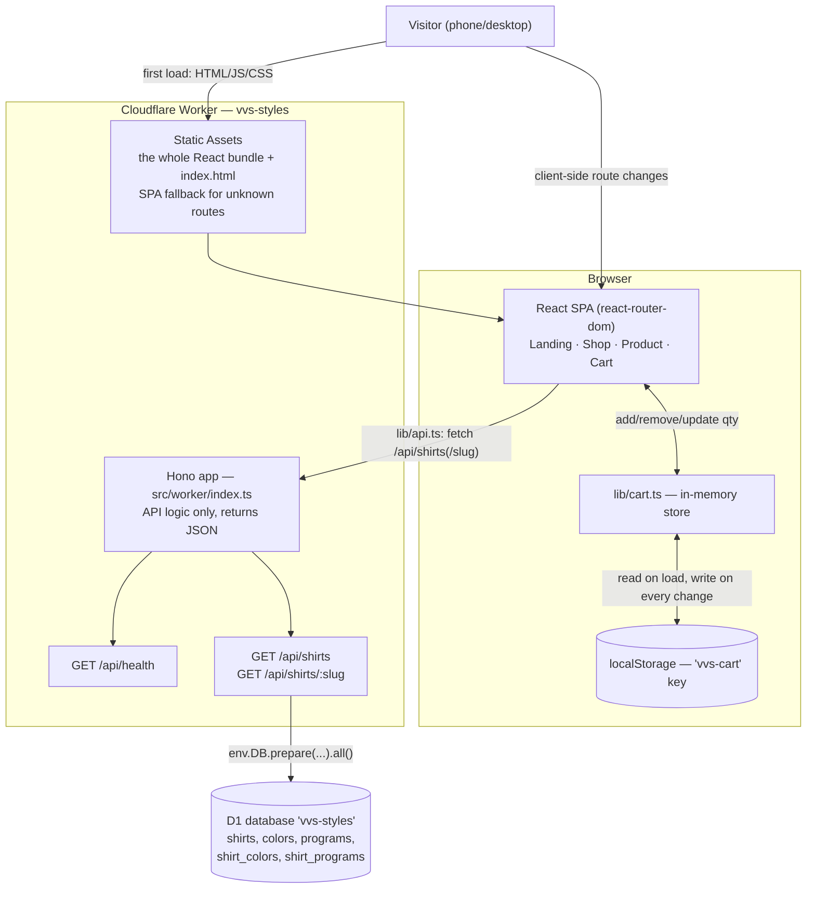

# Architecture

_Last regenerated: 2026-05-22 (end of Phase 2). Regenerate this at the end of each week — if it no longer matches the code, something drifted and it's worth a 10-minute review._

## Diagram

## How it works

vvs-styles is a single Cloudflare Worker that does two unrelated jobs. **First job: serve the website.** The entire React app — every page (Landing, Shop, Product, Cart), all its JavaScript and CSS — is compiled into a bundle of *static assets*. On a visitor's first load the Worker hands over that whole bundle; from then on, navigating between pages happens inside the browser with no server trips (react-router swaps components in place). **Second job: answer data questions.** A small Hono app handles anything starting with `/api/*` — it never serves a page, it only returns JSON (the shirt catalog, or one shirt's color/program options). Hono reads that data from a Cloudflare D1 database. The Worker decides per request which job applies: `wrangler.toml` says `run_worker_first = ["/api/*"]`, so API URLs go to Hono and everything else falls through to static assets.

The **shopping cart never touches the server.** `lib/cart.ts` is plain JavaScript inside the React bundle; it keeps cart items in memory and mirrors them to the browser's `localStorage` under the key `vvs-cart`. That's why a cart survives a page refresh but does not follow the visitor to a different device — there are no user accounts and no cart table in D1.

### The one distinction that matters: Static Assets vs. Hono

When a visitor on `/shop` taps a shirt and the Product page appears, two separate things happen:

1. **The Product page itself** — the layout, color swatches, program radio buttons, size dropdown, clean-time box, live preview — is React code that was **already in the browser** from the first load. It is part of Static Assets. Tapping a shirt shows it *instantly*, with no server trip.
2. **The data that fills those controls** — which colors and programs *this particular shirt* offers — is the only part that comes from Hono. The Product component fetches `GET /api/shirts/:slug`, Hono runs three D1 queries, and JSON comes back.

Restaurant analogy: Static Assets is the printed menu already on your table (the whole thing). Hono is the kitchen — you never see it, you send it an order and it sends back a plate of data. Tapping a shirt doesn't make the kitchen build a new page; the page (a blank order form) was already there — the kitchen just tells you what's available to check off on it.

## Decisions

- **One Worker serves both the SPA and the API**, rather than splitting UI onto Cloudflare Pages and the API elsewhere. `run_worker_first = ["/api/*"]` routes API URLs to Hono; all other paths serve static assets. One name, one deploy, one mental model.
- **`not_found_handling = "single-page-application"`** — unknown paths like `/shop` or `/product/red-tee` return `index.html` instead of a 404, so client-side routing works even on a hard refresh or a shared link.
- **The cart lives in `localStorage`, not D1.** There are no user accounts yet, so a server-side cart would add a database table and an API surface for no real gain at this stage. Trade-off accepted on purpose: the cart survives a refresh but not a device switch. Revisit if/when accounts arrive.

## Not yet built

These appear in the menu or the build plan but are not in the code as of 2026-05-22:

- **About and FAQ pages** — currently hit a `ComingSoon` placeholder (Phase 5).
- **Checkout and payment** — no `/checkout` route, no Stripe/PayPal, no `orders` table (Phase 3).
- **Order routing + confirmation email** — no dropship or email integration (Phase 4).
